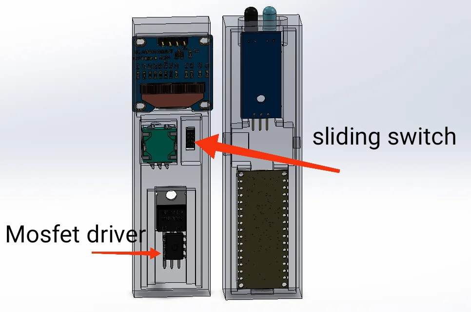
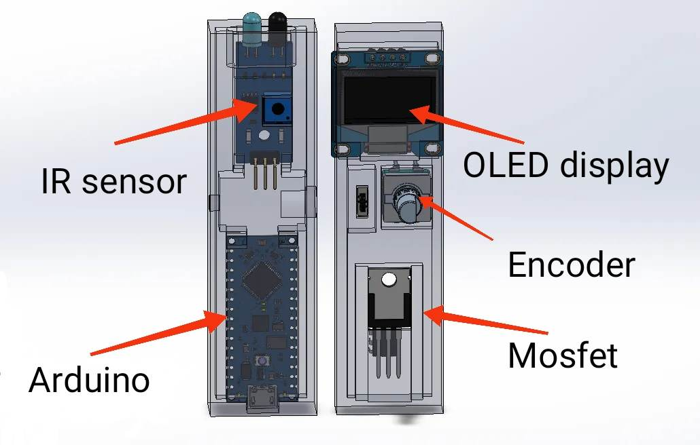
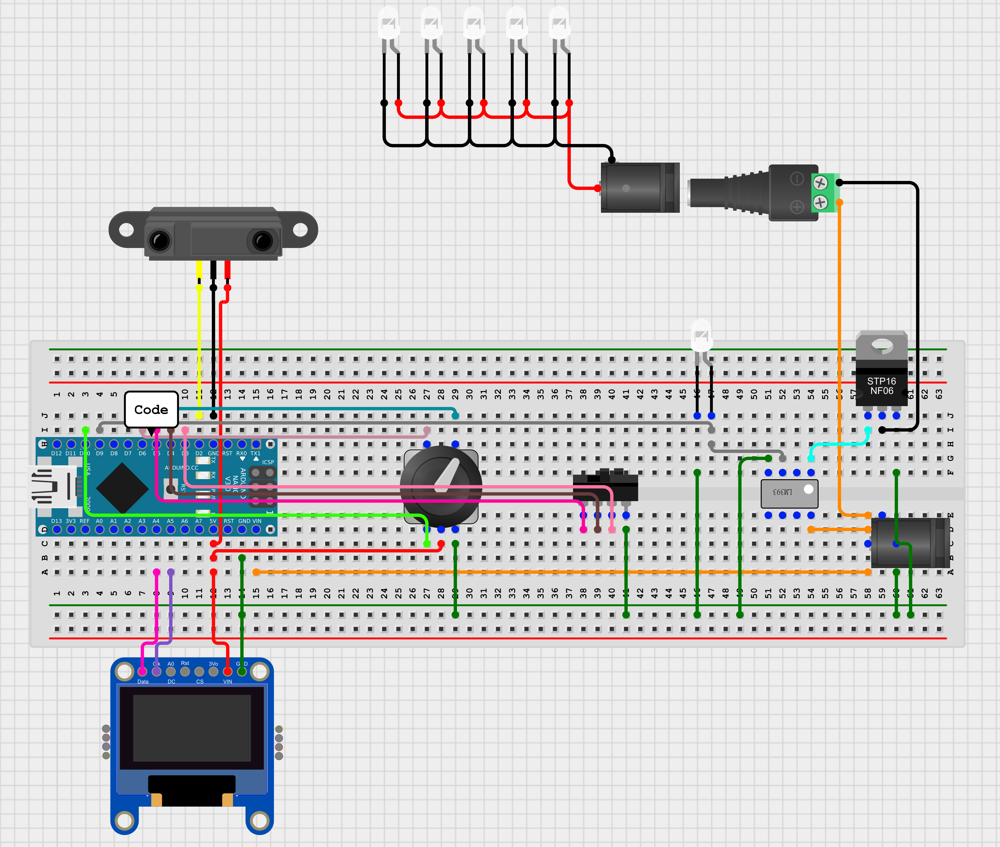

# Arduino_tachometer_with_stoboscopic_effect

The purpose of this tool is to measure any rotation speed with the same accuracy as a commercial product,
it can also blink at afrequency defined by the user to match the roatation of anything up to 1Khz.

It can be powered with usb (5V) or with a 12V power supply, when it's connected to 12V the tachometer can output 12V (20A max) at the blinking frequency. 
Since my workshop has a 12V power line to feed my LED lights and tools this allow me to blink all my lights simultaneously to analyze the rotation of any tool.

The left gift show my spindle's CNC at 12 000rpm with the matching frequency. The other gift show the same setup with a slightly different blinking frequency.

# Part list
| Part | Quantity | Cost |
|- | - | - |
| Arduino Nano | 1 | 5€ |
| IR barrirer sensor | 1 | 2€ |
| White LED | 1 | 0€ |
| Male + female jack connector| 1 | 3€ |
| 0.96" OLED display | 1 | 3€ |
| IRFZ44N Mosfet | 1 | 3€ |
| 3 pos sliding switch | 1 | 2€ |
| Rotary encoder | 1 | 2€ |
| TC4428 Mosfet driver | 1 | 5€ |

# 3D Printing

In most of my design I normally use screws for assembly but this time I wanted the most compact tool as possible so there is just 2 shells which can be hot glue together the everithing is wired correctly and tested. 
You can draw a bigger shell if you are more confortable with screws or if you aren't sure of the wirring

The two shells are printed with standard PLA 20% infil 3 wals and 3/4 top/bottom layers.

All components should properly fit in the case as shown bellow. I couldn't found the proper OLED display on GrabCad but the real one fit perfectly.

# Wirring

The wirring isn't verry complicated, the only tricky part is the mosfet wirring.
Since its a N-Channel Mosfet the drain (middle part) is connected to the output and the source to the power suply's ground.

The gate is connected to a non inverting output from the Mosfet driver, and the driver itself is powered by the 12V and the signal is send by a PWM pin from the arduino.

I'll recommand you to use a small piece of perfboard to wire the mosfet and the driver properly! And please make sure tu use the appropriate wire thickness according to the current value.

All the others connextion can be found on the schematic below and in the code!

# Code

The code is availlable [here](code/tachostrob.ino) nothing specific in this one except interuption but you can find a lots tutorial about that 

# Tests and assembly

Please don't made the same error as me and test every functionnality before glueing the two parts
